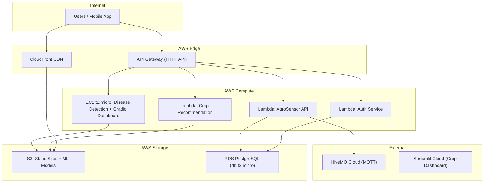
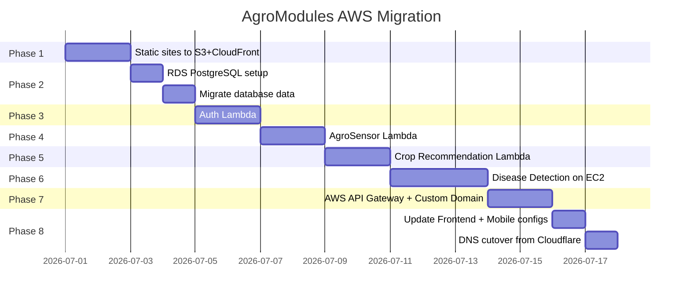

# AgroModules → AWS Free Tier Migration Guide

## Your Current Architecture (Local/Cloudflare Tunnel)

| Service | Port | Tech Stack | Database | Notes |
|---|---|---|---|---|
| **Web Homepage** | 8505 | Static HTML/CSS/JS + Python `serve.py` | None | Landing page at `agroaiapp.me` |
| **API Gateway** | 8080 | FastAPI (Python) | None | Routes to all backends |
| **Auth Service** | 8002 | FastAPI + SQLAlchemy | PostgreSQL (`agrodb`) | JWT auth, users table |
| **AgroSensor API** | 8000 | FastAPI + SQLAlchemy (async) | PostgreSQL (`agrosensor`) | MQTT → HiveMQ Cloud |
| **Crop Recommendation** | 8001 | FastAPI + scikit-learn/XGBoost | File-based (`.pkl` models) | ML inference |
| **Plant Disease Detection** | 8003 | FastAPI + PyTorch | File-based (`.pth` models) | EfficientNet-B4 models |
| **Sensor Dashboard** | 8502 | Static HTML/CSS/JS | None | Served via `http.server` |
| **Disease Dashboard** | 7860 | Gradio (Python) | None | Interactive ML UI |
| **Crop Dashboard** | Streamlit Cloud | Streamlit | None | Already cloud-hosted |

---

## Feasibility Verdict

> [!IMPORTANT]
> **Partially feasible on AWS Free Tier.** Most services map cleanly to free-tier AWS services, but the **Plant Disease Detection** module has ML models totaling **~630 MB** which **exceeds Lambda's 250 MB deployment limit** (even with container images at 10 GB, cold starts would be 30-60+ seconds). The **Crop Recommendation** models are also large (~193 MB for the latest). These need special handling.

### What Works on Free Tier ✅

| Component | AWS Service | Free Tier Allowance |
|---|---|---|
| Web Homepage (static) | **S3 + CloudFront** | 5 GB S3 storage, 1 TB/mo CloudFront transfer (first 12 months) |
| Sensor Dashboard (static) | **S3 + CloudFront** | Same bucket, different path |
| API Gateway routing | **AWS API Gateway (HTTP API)** | 1 million API calls/mo free (12 months) |
| Auth Service | **AWS Lambda** | 1M requests + 400,000 GB-sec/mo free |
| AgroSensor API | **AWS Lambda** | Same pool as above |
| PostgreSQL (Auth + Sensor) | **RDS PostgreSQL** | `db.t3.micro`, 20 GB, 750 hrs/mo (12 months) |
| Domain + HTTPS | **Route 53 + ACM** | ACM certificates are free; Route 53 is $0.50/mo per zone |

### What's Problematic ⚠️

| Component | Issue | Solution |
|---|---|---|
| **Plant Disease Detection** | 10 `.pth` model files = **~630 MB total**. Lambda max = 250 MB zipped (10 GB container). Cold starts 30-60s+ with PyTorch. | **Option A**: Use **EC2 `t2.micro`** (free tier, 750 hrs/mo) — run as always-on service. **Option B**: Use **Lambda with container image** from ECR (10 GB limit), accept cold starts. **Option C**: Use only 1-2 models instead of 10. |
| **Crop Recommendation** | `best_model_2026_05.pkl` = **193 MB**, calibrator = **193 MB**. Total ~400 MB. | Use the **compressed model** (`best_model_2026_05_compressed.pkl` = 37 MB) + compressed calibrator (4 KB). Fits in Lambda. |
| **Disease Dashboard (Gradio)** | Gradio is a full Python web server — not suitable for Lambda. | Host on the **EC2 `t2.micro`** instance alongside Disease Detection. Alternatively, deploy to **Hugging Face Spaces** (free). |
| **MQTT Sensor Polling** | Lambda is request-driven, not long-running. Sensor polling needs a persistent connection. | Keep **HiveMQ Cloud** for MQTT. Use **Lambda + EventBridge** for periodic polling, or run the poller on EC2. |

---

## Recommended AWS Architecture



---

## Step-by-Step Migration

### Phase 0: Prerequisites

- [ ] **Create an AWS account** (you get 12 months of Free Tier)
- [ ] **Install AWS CLI v2**: `winget install Amazon.AWSCLI`
- [ ] **Configure credentials**: `aws configure` (set region to `ap-south-1` for Mumbai — lowest latency for Maharashtra-focused app)
- [ ] **Install Docker Desktop** (needed for Lambda container images)
- [ ] **Install SAM CLI**: `winget install Amazon.SAM-CLI` (for Lambda deployment)

---

### Phase 1: Static Sites → S3 + CloudFront

This covers: **Web Homepage** + **Sensor Dashboard**

#### Step 1.1: Create S3 Bucket
```powershell
aws s3 mb s3://agromodules-static --region ap-south-1
```

#### Step 1.2: Upload Static Files
```powershell
# Web homepage
aws s3 sync ./web/ s3://agromodules-static/web/ `
  --exclude "*.py" --exclude "*.pyc" --exclude "__pycache__/*" `
  --exclude "venv/*"

# Sensor dashboard
aws s3 sync ./AgroSensor/dashboard/ s3://agromodules-static/sensor-dashboard/
```

#### Step 1.3: Create CloudFront Distribution
```powershell
# Create an Origin Access Control for S3
aws cloudfront create-origin-access-control `
  --origin-access-control-config '{
    "Name": "agromodules-oac",
    "OriginAccessControlOriginType": "s3",
    "SigningBehavior": "always",
    "SigningProtocol": "sigv4"
  }'

# Create CloudFront distribution (save the distribution ID from output)
aws cloudfront create-distribution `
  --distribution-config file://cloudfront-config.json
```

You'll need to create a `cloudfront-config.json` — I can generate this for you if you want to proceed.

#### Step 1.4: Update S3 Bucket Policy
Allow CloudFront to read from S3 (replace `DISTRIBUTION_ID`):
```json
{
  "Version": "2012-10-17",
  "Statement": [{
    "Effect": "Allow",
    "Principal": {"Service": "cloudfront.amazonaws.com"},
    "Action": "s3:GetObject",
    "Resource": "arn:aws:s3:::agromodules-static/*",
    "Condition": {
      "StringEquals": {
        "AWS:SourceArn": "arn:aws:cloudfront::ACCOUNT_ID:distribution/DISTRIBUTION_ID"
      }
    }
  }]
}
```

#### Step 1.5: Configure Custom Domain (Optional)
```powershell
# Request SSL certificate (free via ACM)
aws acm request-certificate `
  --domain-name agroaiapp.me `
  --subject-alternative-names "*.agroaiapp.me" `
  --validation-method DNS `
  --region us-east-1  # CloudFront requires us-east-1 certs
```
Then add the DNS validation CNAME records in your Cloudflare DNS.

---

### Phase 2: PostgreSQL → RDS

This covers: **Auth DB (`agrodb`)** + **AgroSensor DB (`agrosensor`)**

#### Step 2.1: Create RDS Instance
```powershell
aws rds create-db-instance `
  --db-instance-identifier agromodules-db `
  --db-instance-class db.t3.micro `
  --engine postgres `
  --engine-version 16.4 `
  --master-username postgres `
  --master-user-password "USE_A_STRONG_PASSWORD_HERE" `
  --allocated-storage 20 `
  --storage-type gp2 `
  --no-multi-az `
  --publicly-accessible `
  --vpc-security-group-ids sg-XXXXXXXX `
  --region ap-south-1
```

> [!WARNING]
> **Free Tier limit**: 750 hours/month of `db.t3.micro`. Running **one instance 24/7 = 720 hrs/mo** → fits. But **two instances would exceed the limit**. Use **one RDS instance with two databases** (`agrodb` + `agrosensor`).

#### Step 2.2: Create Both Databases
```sql
-- Connect to RDS endpoint
psql -h agromodules-db.XXXXX.ap-south-1.rds.amazonaws.com -U postgres

-- Create both databases
CREATE DATABASE agrodb;
CREATE DATABASE agrosensor;
```

#### Step 2.3: Migrate Data
```powershell
# Export from local PostgreSQL
pg_dump -U postgres -d agrodb > agrodb_backup.sql
pg_dump -U postgres -d agrosensor > agrosensor_backup.sql

# Import to RDS
psql -h YOUR_RDS_ENDPOINT -U postgres -d agrodb < agrodb_backup.sql
psql -h YOUR_RDS_ENDPOINT -U postgres -d agrosensor < agrosensor_backup.sql
```

---

### Phase 3: Auth Service → Lambda

#### Step 3.1: Adapt Code for Lambda

Create a `lambda_handler.py` wrapper using **Mangum** (FastAPI → Lambda adapter):

```python
# Auth/lambda_handler.py
from mangum import Mangum
from main import app

# Override DB connection to use RDS endpoint via env vars
import os
os.environ.setdefault("AUTH_DB_HOST", "agromodules-db.XXXXX.rds.amazonaws.com")
os.environ.setdefault("AUTH_DB_PASSWORD", "YOUR_RDS_PASSWORD")

handler = Mangum(app, lifespan="off")
```

#### Step 3.2: Create Deployment Package
```powershell
# In Auth directory
pip install -r requirements.txt mangum -t ./package/
Copy-Item main.py, config.py, database.py, models.py, schemas.py, auth_utils.py ./package/
cd package
Compress-Archive -Path * -DestinationPath ../auth-lambda.zip
```

#### Step 3.3: Deploy Lambda
```powershell
aws lambda create-function `
  --function-name agromodules-auth `
  --runtime python3.12 `
  --handler lambda_handler.handler `
  --zip-file fileb://auth-lambda.zip `
  --role arn:aws:iam::ACCOUNT_ID:role/lambda-execution-role `
  --timeout 30 `
  --memory-size 256 `
  --environment "Variables={AUTH_DB_HOST=YOUR_RDS_ENDPOINT,AUTH_DB_PASSWORD=YOUR_PASSWORD}" `
  --region ap-south-1
```

---

### Phase 4: AgroSensor API → Lambda

Same pattern as Auth — use Mangum wrapper. Key difference:

> [!IMPORTANT]
> The AgroSensor service uses **async SQLAlchemy** (`asyncpg`). Mangum supports async FastAPI apps, so this works. But the **MQTT polling loop** (sensor reading) must be decoupled — use **EventBridge Scheduler** to trigger a separate Lambda every N minutes to poll MQTT/HiveMQ and write to RDS.

```python
# AgroSensor/lambda_handler.py
from mangum import Mangum
from main import app

handler = Mangum(app, lifespan="off")
```

For MQTT polling, create a separate Lambda:
```python
# AgroSensor/mqtt_poller_lambda.py
import paho.mqtt.client as mqtt
# ... connect to HiveMQ, read last message, write to RDS
```

Schedule it:
```powershell
aws scheduler create-schedule `
  --name sensor-poll-schedule `
  --schedule-expression "rate(2 minutes)" `
  --target '{"Arn":"arn:aws:lambda:ap-south-1:ACCOUNT:function:sensor-mqtt-poller","RoleArn":"arn:aws:iam::ACCOUNT:role/scheduler-role"}'
```

---

### Phase 5: Crop Recommendation → Lambda

#### Step 5.1: Use Compressed Models

Your compressed model is **37 MB** — this fits in a Lambda deployment package. The full model is 193 MB and won't.

```python
# Crop_Recommendation_Engine/lambda_handler.py
import os
os.environ["MODEL_STAMP"] = "2026_05_compressed"  # use compressed variants

from mangum import Mangum
from api import app

handler = Mangum(app, lifespan="off")
```

#### Step 5.2: Store Models in S3, Load at Runtime

If the compressed model + dependencies exceed 250 MB zipped, use **Lambda Layers** or **S3 loading**:

```python
import boto3, joblib, tempfile

s3 = boto3.client("s3")

def load_model_from_s3():
    with tempfile.NamedTemporaryFile(suffix=".pkl") as tmp:
        s3.download_file("agromodules-models", "crop/best_model_compressed.pkl", tmp.name)
        return joblib.load(tmp.name)
```

#### Step 5.3: Use Container Image (if needed)

If scikit-learn + XGBoost + numpy exceed the zip limit:

```dockerfile
# Crop_Recommendation_Engine/Dockerfile
FROM public.ecr.aws/lambda/python:3.12
COPY requirements.txt .
RUN pip install -r requirements.txt mangum
COPY . ${LAMBDA_TASK_ROOT}
CMD ["lambda_handler.handler"]
```

```powershell
# Build and push to ECR
aws ecr create-repository --repository-name agromodules-crop
docker build -t agromodules-crop .
docker tag agromodules-crop:latest ACCOUNT.dkr.ecr.ap-south-1.amazonaws.com/agromodules-crop:latest
aws ecr get-login-password | docker login --username AWS --password-stdin ACCOUNT.dkr.ecr.ap-south-1.amazonaws.com
docker push ACCOUNT.dkr.ecr.ap-south-1.amazonaws.com/agromodules-crop:latest
```

---

### Phase 6: Plant Disease Detection → EC2 `t2.micro`

> [!CAUTION]
> **This service CANNOT run on Lambda effectively.** The 10 PyTorch model files total **630 MB**. Even with a container image, cold starts with PyTorch would be **30-60+ seconds**. The `t2.micro` (1 vCPU, 1 GB RAM) is tight for PyTorch but workable if you load only 1-2 models at a time instead of all 10.

#### Step 6.1: Launch EC2 Instance
```powershell
aws ec2 run-instances `
  --image-id ami-0dee22c13ea7a9a67 `  # Amazon Linux 2023 (ap-south-1)
  --instance-type t2.micro `
  --key-name your-key-pair `
  --security-group-ids sg-XXXXXXXX `
  --tag-specifications "ResourceType=instance,Tags=[{Key=Name,Value=agromodules-disease}]" `
  --region ap-south-1
```

#### Step 6.2: Setup on EC2
```bash
# SSH into EC2
ssh -i your-key.pem ec2-user@EC2_PUBLIC_IP

# Install dependencies
sudo yum install python3.12 python3.12-pip git -y
pip3 install torch torchvision --index-url https://download.pytorch.org/whl/cpu
pip3 install fastapi uvicorn gradio pillow python-multipart

# Upload code + models (or pull from S3)
aws s3 sync s3://agromodules-models/disease/ ~/disease/

# Run as systemd service
sudo tee /etc/systemd/system/disease-api.service << 'EOF'
[Unit]
Description=Plant Disease Detection API
After=network.target

[Service]
User=ec2-user
WorkingDirectory=/home/ec2-user/disease
ExecStart=/usr/bin/python3 -m uvicorn api:app --host 0.0.0.0 --port 8003
Restart=always

[Install]
WantedBy=multi-user.target
EOF

sudo systemctl enable --now disease-api
```

#### Step 6.3: Reduce Memory Usage

With only 1 GB RAM on `t2.micro`, load **only the `all` model** by default instead of all crop-specific variants:

```python
# Modify MODEL_CANDIDATES to only include the general model
MODEL_CANDIDATES = {
    "all": {
        "efficientnet_b4": ["efficientnet_b4_all_final.pth"],
    },
}
```

This reduces model memory from ~630 MB to ~68 MB. Load crop-specific models on-demand if needed.

---

### Phase 7: AWS API Gateway (HTTP API)

Replace your custom `ApiGateway` FastAPI proxy with **AWS API Gateway HTTP API**:

#### Step 7.1: Create HTTP API
```powershell
aws apigatewayv2 create-api `
  --name agromodules-api `
  --protocol-type HTTP `
  --region ap-south-1
```

#### Step 7.2: Create Routes
```powershell
# Auth routes → Lambda
aws apigatewayv2 create-route --api-id API_ID --route-key "ANY /auth/{proxy+}"
# Sensor routes → Lambda
aws apigatewayv2 create-route --api-id API_ID --route-key "ANY /sensor/{proxy+}"
# Crop routes → Lambda
aws apigatewayv2 create-route --api-id API_ID --route-key "ANY /crop/{proxy+}"
# Disease routes → EC2 (via HTTP integration)
aws apigatewayv2 create-route --api-id API_ID --route-key "ANY /disease/{proxy+}"
```

#### Step 7.3: Custom Domain
```powershell
aws apigatewayv2 create-domain-name `
  --domain-name api.agroaiapp.me `
  --domain-name-configurations CertificateArn=arn:aws:acm:ap-south-1:ACCOUNT:certificate/CERT_ID
```

---

### Phase 8: Update Mobile App & Frontend

Update API base URLs in:

| File | Current | New |
|---|---|---|
| [config.js](file:///c:/Users/Aniket/OneDrive/Documents/College/SEM7/project/AgroModules/web/config.js) | `https://api.agroaiapp.me` | `https://API_ID.execute-api.ap-south-1.amazonaws.com` (or custom domain) |
| [.mobile_env](file:///c:/Users/Aniket/OneDrive/Documents/College/SEM7/project/AgroModules/AgroMobile/.mobile_env) | Same | Same |

If you set up the custom domain `api.agroaiapp.me` on AWS API Gateway, **no code changes needed** — just update DNS records.

---

## Monthly Cost Estimate (Free Tier)

| Service | Free Tier Allowance | Your Usage | Cost |
|---|---|---|---|
| **S3** | 5 GB storage, 20K GET/mo | ~100 MB static files | **$0** |
| **CloudFront** | 1 TB transfer, 10M requests/mo | Minimal for college project | **$0** |
| **Lambda** | 1M requests, 400K GB-sec/mo | ~10K requests/mo (estimate) | **$0** |
| **API Gateway** | 1M HTTP API calls/mo | ~10K calls/mo | **$0** |
| **RDS PostgreSQL** | 750 hrs `db.t3.micro`, 20 GB | 1 instance 24/7 = 720 hrs | **$0** |
| **EC2 `t2.micro`** | 750 hrs/mo | 1 instance 24/7 = 720 hrs | **$0** |
| **ECR** | 500 MB storage | ~200 MB container image | **$0** |
| **Route 53** | Not free | 1 hosted zone | **~$0.50/mo** |
| **Data transfer** | 100 GB/mo out | Minimal | **$0** |

> [!NOTE]
> **Total estimated cost: ~$0.50/month** (just Route 53). All other services fit within the 12-month Free Tier. After 12 months, expect **~$25-40/month** (RDS and EC2 are the big ones).

---

## What About DynamoDB Instead of RDS?

> [!TIP]
> DynamoDB's free tier (**25 GB storage, 25 RCU, 25 WCU — always free, not just 12 months**) is attractive. However, your Auth service uses **SQLAlchemy with relational models** (users table with foreign keys, JOINs). Migrating to DynamoDB would require rewriting the data layer. **Recommendation**: Stick with RDS PostgreSQL for the 12-month free tier. If you want to continue free after 12 months, *then* consider migrating Auth to DynamoDB + rewriting with `boto3`.

---

## Migration Order (Recommended)



---

## Key Decisions Needed From You

1. **Disease Detection hosting**: Go with EC2 `t2.micro` (simpler) or try Lambda container image (serverless but slow cold starts)?
2. **How many disease models to keep active?** All 10 (~630 MB) or just the general `all` model (~68 MB)?
3. **Database**: Stick with PostgreSQL on RDS (12-mo free) or switch to DynamoDB (always free, requires code rewrite)?
4. **Domain**: Keep `agroaiapp.me` on Cloudflare DNS and just point to AWS, or transfer DNS to Route 53?
5. **Do you want me to generate the actual deployment scripts and config files** to start migrating?
